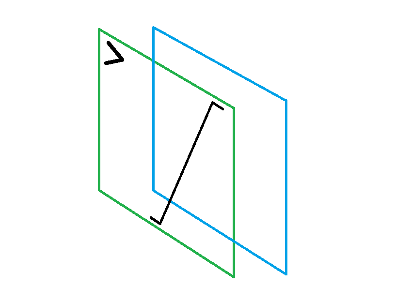

# pyculas



# Installation Instructions
use pip or pip3 to install the library.
```
pip install pyculas
```
# Note:
Currently this library support only algebraic expressions. Soon we will update for trigonometric, logarithmic expressions , etc.

## Usage

This class takes a list of terms in a polynomial expression

## Importing

```
from pyculas import Expression
```

## Examples of usage:

If you have 4x^3 - 2x + 6, then create the object as follows -

A = Expression.algebraic("4x^3 - 2x + 6")


### Differentiation

1.If only final expression required

Q. `2x^2+2`

```
A = Expression.algebraic("2x^2 + 2")
print(A.differentiate())
```
Output:

`('4.000x', None)`

2.To get value at a point

Q. Find the differentiation of `2x^2+2` at x=3. 

```
A = Expression.algebraic("2x^2 + 2")
print(A.differentiate(value=3,level=1))
```
Output:

`('4.000x', 8.0)`     

Here `value` means at which point you want to differentiate and `level` means the nth derivative.

### Integration

1.If only final expression required

Q. `2x^2+2`

```
A = Expression.algebraic("2x^2 + 2")
print(A.integrate())
```
Output:

`('0.667x^3.000 + 2.0x + c', None)`

2.To evaluate when limits are given

Q. `2x^2+2`

```
A = Expression.algebraic("2x^2 + 2")
print(A.integrate(upper_limit=4 , lower_limit=2))
```
Output:

`('0.667x^3.000 + 2.0x + c', 41.352)`
